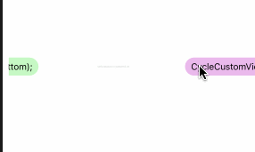

# EntertainingDiversions
分段式跑马灯，主要为解决重用，内部使用了CADisplayLink 如果觉得影响手机性能，可以使用其他的处理。

# 当前版本 1.0.1

### 使用方法

> 安装：pod 'RunCircleView','~> 1.0.1'


> CycleCustomView  可以在xib中直接设置 也可以用代码创建

```
CycleCustomView *customV = [[CycleCustomView alloc]init]; //普通的初始化
customV.dataSource = self;
customV.delegate = self;

```
> 注册cell

```
// 可以继承自 CycleItem  做处理 注册方式不变
[customV registItem:[CycleItem class] withIdentifier:@"item"];

```
> 实现两个 dataSource 方法
```
/** 返回数据个数 */
-(NSInteger)runItemCountWithCycleCustomView:(CycleCustomView *)cycleView;
/* 添加子控件以及一些其他数据 */
-(CycleItem *)cycleCustomView:(CycleCustomView *)cycleView andIndex:(NSInteger)index;
```
> 实现点击 和 宽度 间距 设置。
```
/* 返回每个的宽度 默认是一半的宽度 */
-(CGFloat)runWidthWithCycleCustomView:(CycleCustomView *)cycleView
							 andIndex:(NSInteger)index;
/** 返回第二个的间距 默认为 5 */
-(CGFloat)cycleCustomView:(CycleCustomView *)cycleView itemMarginLeftWithIndex:(NSInteger)index;

/** 点击了第几个 */
-(void)cycleCustomView:(CycleCustomView *)cycleView didSeletedItem:(CycleItem *)item withIndex:(NSInteger)index;
/** 起始时的相对位置 默认为 0*/
-(CGFloat)startItemLeftMargin:(CycleCustomView *)cycleView;
```


### 效果图



